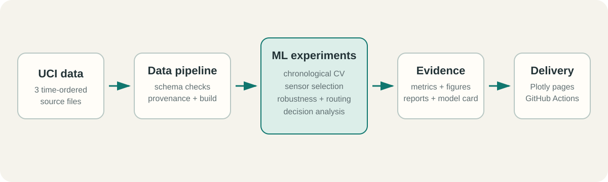
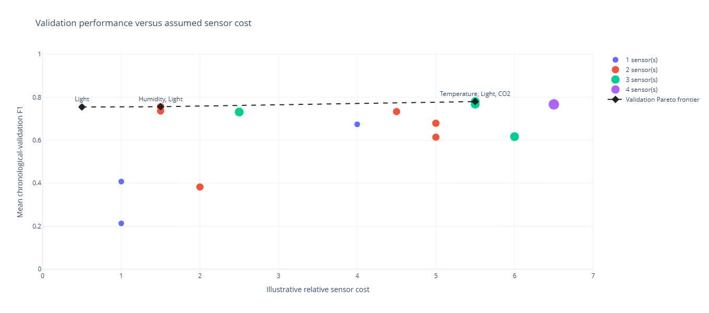

# SensorBudget

[](https://github.com/michael-slota/sensorbudget/actions/workflows/ci.yml)

SensorBudget is an applied machine-learning project for detecting office
occupancy from environmental sensors while asking a practical question:

> How accurately and reliably can occupancy be detected with fewer, cheaper
> sensors?

## Live demo

**[Open the interactive SensorBudget dashboard suite →](https://michael-slota.github.io/sensorbudget/)**

The live site is the fastest way to review the project. Its guided route covers
model performance, sensor trade-offs, robustness, and decision analysis, with
additional dashboards for EDA and fault mitigation. Each page combines a short
method summary, headline metrics, interactive Plotly views, interpretation, and
links to the underlying evidence.

The interactive figures are currently designed for the best experience on a
desktop or laptop display; a dedicated mobile-layout audit is planned.

For a technical review, continue with the [model card](reports/model_card.md)
and use the [results index](reports/README.md) to trace each conclusion to its
detailed report.

## Project at a glance

The project uses the UCI Occupancy Detection dataset, which contains
time-stamped temperature, humidity, light, CO2, humidity-ratio, and binary
occupancy observations.

| At a glance | Summary |
|---|---|
| Problem | Detect office occupancy accurately and reliably with fewer, lower-cost sensors |
| Data | 20,560 time-ordered observations from one office room |
| Method | Chronological validation, complete sensor ablation, fault simulation, and decision analysis |
| Research candidate | Class-balanced logistic regression using Temperature, Light, and CO2 |
| Clean held-out F1 | 0.971 on the earlier period; 0.980 on the later period |
| Main reliability risk | Critical dependence on the historical relationship between Light and occupancy |
| Conclusion | Strong clean research result, but insufficient external and fault evidence for deployment |

## Results at a glance

The main research candidate is a class-balanced logistic regression using
Temperature, Light, and CO2. It was selected through expanding chronological
validation and evaluated at the reference threshold of 0.50. The first
evaluation period precedes training; the second follows it.

| Held-out period | F1 | Precision | Recall |
|---|---:|---:|---:|
| First evaluation period | **0.971** | 0.946 | 0.998 |
| Second evaluation period | **0.980** | 0.967 | 0.994 |

The wider analysis changes how those clean scores should be interpreted:

- **Sensor trade-off:** all 15 physical-sensor combinations were evaluated.
  Three Light-containing configurations remain Pareto-efficient across five
  illustrative cost scenarios, without establishing a final hardware choice.
- **Reliability:** occupied darkness and complete Light loss reduce F1 to
  approximately zero. Additional sensors do not create automatic fallback
  behaviour when the fitted model still depends on Light.
- **Mitigation:** detector routing is the strongest tested mitigation overall,
  but plausible faults remain difficult to identify and false alarms invoke a
  weaker fallback unnecessarily.
- **Decision threshold:** validation selected 0.86 under illustrative equal
  error costs, but that advantage did not transfer to either held-out period.
  Threshold 0.50 remains the stronger observed reference, not a universal
  optimum.

The project began with an all-sensor model comparison, where histogram gradient
boosting obtained F1 of 0.930 in the first evaluation period and 0.883 in the
second. The later
sensor-budget study selected the three-sensor logistic candidate used for the
robustness, mitigation, and explainability work. See the
[model card](reports/model_card.md) for the consolidated evidence and the
[baseline report](reports/baseline_results.md) for the initial comparison.

## Project architecture



The command-line pipelines create reproducible artifacts from immutable source
data. Notebooks explain and inspect those artifacts; they are not required to
run the training or evaluation workflows.

## Implementation scope

| Area | Implementation |
|---|---|
| Data engineering | Validated imports, schema checks, immutable raw data, processed-data build, and provenance metadata |
| Machine learning | Chronological cross-validation, five classifier families, sensor-subset selection, and fixed held-out evaluation |
| Reliability | Missingness, noise, drift, stuck sensors, changed room behaviour, fault detection, fallback routing, and fault-aware training |
| Decision support | Relative sensor-cost scenarios, Pareto analysis, threshold costs, calibration, and model explanations |
| Software delivery | Installable Python package, command-line modules, automated tests and linting, CI, and static Plotly dashboards on GitHub Pages |

### Headline visualization



Validation performance versus illustrative sensor cost. Connected points form
the Pareto frontier: no cheaper configuration achieves a higher mean
validation F1. Costs are scenario assumptions rather than market prices.

## Project goals

1. Build a leakage-safe occupancy-classification baseline.
2. Compare predictive performance across sensor subsets.
3. Quantify the value and risk of relying on the light sensor.
4. Test robustness to sensor noise, missing readings, drift, and failure.
5. Select a model using both predictive quality and operational cost.
6. Package the final pipeline as a reproducible software project.

## Repository layout

```text
sensorbudget/
|-- configs/                 # Versioned experiment settings
|-- data/
|   |-- external/            # Third-party reference data
|   |-- interim/             # Intermediate transformations
|   |-- processed/           # Model-ready datasets
|   `-- raw/                 # Immutable source data
|-- docs/
|   |-- decisions/           # Architecture and methodology decisions
|   |-- data_dictionary.md
|   |-- evaluation_plan.md
|   |-- experiment_catalog.md
|   `-- roadmap.md
|-- models/                  # Serialized models and metadata (not in Git)
|-- notebooks/               # Numbered exploratory notebooks
|-- references/              # Papers, links, and background notes
|-- reports/
|   `-- figures/             # Generated charts
|-- src/sensorbudget/
|   |-- data/                # Loading, validation, and provenance
|   |-- features/            # Feature engineering
|   |-- modeling/            # Training, prediction, and evaluation
|   `-- robustness/          # Sensor-fault simulation
`-- tests/                   # Automated tests
```

See the consolidated [model card](reports/model_card.md) for intended use,
evaluation evidence, known failure modes, and pre-deployment requirements.
See [docs/roadmap.md](docs/roadmap.md) for the phased delivery plan and
[docs/experiment_catalog.md](docs/experiment_catalog.md) for suggested
experiments. See [docs/model_training.md](docs/model_training.md) for a
step-by-step explanation of the baseline ML pipeline.

## Dataset

- Source: [UCI Occupancy Detection](https://archive.ics.uci.edu/dataset/357/occupancy%2Bdetection)
- DOI: [10.24432/C5X01N](https://doi.org/10.24432/C5X01N)
- License: CC BY 4.0
- Task: binary classification (`Occupancy` is 0 or 1)
- Size: 20,560 observations across three supplied files

Raw files should remain unchanged after download. Their expected location is:

```text
data/raw/
|-- datatraining.txt
|-- datatest.txt
`-- datatest2.txt
```

See [data/README.md](data/README.md) for data-handling rules.

### Dataset attribution and license

The dataset is third-party material and is **not** covered by this project's
MIT software license.

> Candanedo, L. (2016). *Occupancy Detection* [Dataset]. UCI Machine Learning
> Repository. https://doi.org/10.24432/C5X01N

The dataset is distributed under the
[Creative Commons Attribution 4.0 International license](https://creativecommons.org/licenses/by/4.0/)
(CC BY 4.0). It may be shared and adapted, including for commercial purposes,
provided appropriate credit is given, the license is linked, and changes are
identified. This project parses the source files, combines their supplied
splits for analysis, validates their contents, and creates derived model
artifacts. The original raw files are not committed to this repository.

## Modeling methodology

The primary evaluation uses the dataset's chronological train/test periods.
Randomly splitting individual rows is not suitable for final reporting because
adjacent minute-level readings are highly correlated.

Initial candidates:

- Dummy classifier as the minimum baseline
- Logistic regression as the interpretable baseline
- Decision tree
- Random forest
- Histogram gradient boosting

The main experiment compares:

- all sensors;
- all sensors except light;
- environmental sensors only;
- each individual sensor;
- selected two- and three-sensor combinations.

Models are evaluated with precision, recall, F1, balanced accuracy, PR-AUC,
ROC-AUC, confusion matrices, calibration, inference cost, and robustness.

## Quick start

```powershell
python -m venv .venv
.\.venv\Scripts\Activate.ps1
python -m pip install -e ".[dev]"
pytest
```

Validate the imported source files and build the processed dataset:

```powershell
python -m sensorbudget.data.validate
python -m sensorbudget.data.build
```

The build writes `data/processed/occupancy.csv` and a generated provenance
manifest. Both are reproducible local artifacts and remain outside Git.

Train and evaluate leakage-safe baseline models:

```powershell
python -m sensorbudget.modeling.train
```

This performs expanding chronological validation inside the supplied training
period, selects one all-sensor and one no-Light finalist, and then evaluates
only those finalists on the two held-out periods. Generated models, metrics,
predictions, and metadata are written under `models/baseline/`.

Evaluate all physical-sensor combinations against the versioned relative-cost
scenario:

```powershell
python -m sensorbudget.modeling.sensor_budget
```

This selects one model per combination using chronological validation, then
reports each selected model on the two held-out source periods. Generated artifacts
are written under `models/sensor_budget/`.

Recalculate the validation Pareto frontier under alternative relative-cost
scenarios without retraining the models:

```powershell
python -m sensorbudget.modeling.cost_sensitivity
```

Evaluate the Phase 4 frontier configurations under predefined sensor faults:

```powershell
python -m sensorbudget.robustness.evaluate
```

Evaluate the training-selected Light-independent fallback under known
simulated Light faults:

```powershell
python -m sensorbudget.robustness.fallback
```

Tune the causal Light-health detector on chronological training folds and
evaluate realistic held-out routing:

```powershell
python -m sensorbudget.robustness.fault_detection
```

Train and evaluate fault-aware models with training-only augmentation:

```powershell
python -m sensorbudget.robustness.fault_aware
```

Select validation-only operating thresholds and generate Phase 6 explanations:

```powershell
python -m sensorbudget.modeling.decision_explainability
```

Regenerate the compact data used by the static EDA dashboard:

```powershell
python -m sensorbudget.dashboard.export_eda
python -m sensorbudget.dashboard.export_models
python -m sensorbudget.dashboard.export_sensor_selection
python -m sensorbudget.dashboard.export_robustness
python -m sensorbudget.dashboard.export_mitigation
python -m sensorbudget.dashboard.export_decision
```

The dashboard pages live under `site/` and are deployed to GitHub Pages by
`.github/workflows/pages.yml`. The committed JSON contains aggregates only;
the raw UCI files and row-level model artifacts are not published.

## Working principles

- Preserve temporal ordering during validation.
- Fit every transformation on training data only.
- Keep raw data immutable.
- Version code, configuration, and dataset checksums.
- Separate exploratory notebooks from reusable source code.
- Report operational trade-offs, not accuracy alone.
- Make every reported result reproducible from a committed configuration.

## Current status

The project scaffold, EDA, validated data pipeline, leakage-safe baseline
comparison, complete sensor ablation, cost-sensitivity analysis, Phase 5
reliability experiments, and Phase 6 decision and explainability analysis are
implemented. No unconditional deployment or final sensor recommendation has
been made. See the
[roadmap](docs/roadmap.md), [sensor-budget results](reports/sensor_budget_results.md),
the [robustness results](reports/robustness_results.md), and the
[fallback results](reports/fallback_mitigation_results.md). Interactive
analyses are presented in
[`notebooks/03_sensor_budget_analysis.ipynb`](notebooks/03_sensor_budget_analysis.ipynb)
[`notebooks/04_robustness.ipynb`](notebooks/04_robustness.ipynb), and
[`notebooks/05_fallback_mitigation.ipynb`](notebooks/05_fallback_mitigation.ipynb).
The causal routing analysis is in
[`notebooks/06_fault_detection_and_routing.ipynb`](notebooks/06_fault_detection_and_routing.ipynb).
The fault-aware comparison and reliability conclusion are in
[`notebooks/07_fault_aware_training.ipynb`](notebooks/07_fault_aware_training.ipynb).
The operating-threshold, calibration, explanation, and transition analysis is
in [`notebooks/08_decision_explainability.ipynb`](notebooks/08_decision_explainability.ipynb).

## License

The original software and documentation in this repository are available under
the [MIT License](LICENSE). The UCI dataset remains subject to its separate
CC BY 4.0 license and attribution requirements described above.
